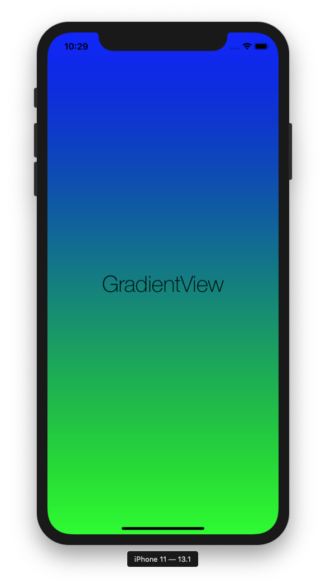

# GradientView


[](https://travis-ci.org/zattoo/GradientView)

GradientView for iOS and tvOS



## Description

GradientView is a view that allow easily adding gradients to your Apps.

## Requirements

- iOS 11.0+
- tvOS 11.0+
- Xcode 11

## Installation

### Cocoapods

To integrate GradientView into your Xcode project using CocoaPods, specify it in your `Podfile`:

```ruby
platform :tvos, '11.0'
use_frameworks!

target '<Your Target Name>' do
    pod 'ZattooGradientView', :git => 'https://github.com/zattoo/GradientView.git'
end
```

### Swift Package Manager

GradientView can be also added as a dependency using Swift Package Manager.

## Usage

All you need is adding an instance of GradientView to your App, like you do with any other view, and customize it using a Gradient.

```swift
import UIKit
import GradientView

class ViewController: UIViewController {

    override func viewDidLoad() {
        super.viewDidLoad()
        setUpView()
    }
    
    // MARK: - Private
    
    private lazy var gradientView: GradientView = {
        let gradient = Gradient(
            startColor: .blue,
            endColor: .green,
            startPoint: CGPoint(x: 0, y: 0),
            endPoint: CGPoint(x: 0, y: 1))
        
        let gradientView = GradientView()
        gradientView.applyGradient(gradient)
        return gradientView
    }()

    private func setUpView() {
        view.addSubview(gradientView)
        gradientView.frame = view.bounds
    }
}
```
